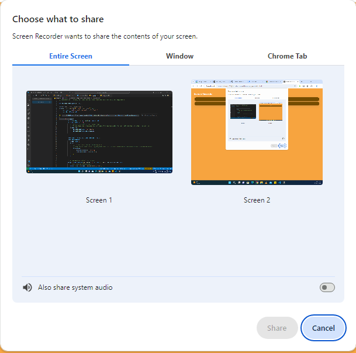

# Screen Recorder
A chrome extensions that uses the chrome.desktopCapture API to capture the screen, window or individual tabs. In addition when a user clicks the extension icon it opens up a full screen page of the HTML. This is to avoid the popup extension from closing when a users clicks away

## Prerequisites
You should look at <b>navigator.mediaDevices.getUserMedia</b> to get streams and how to set up constraints for this sample project to make sense.

