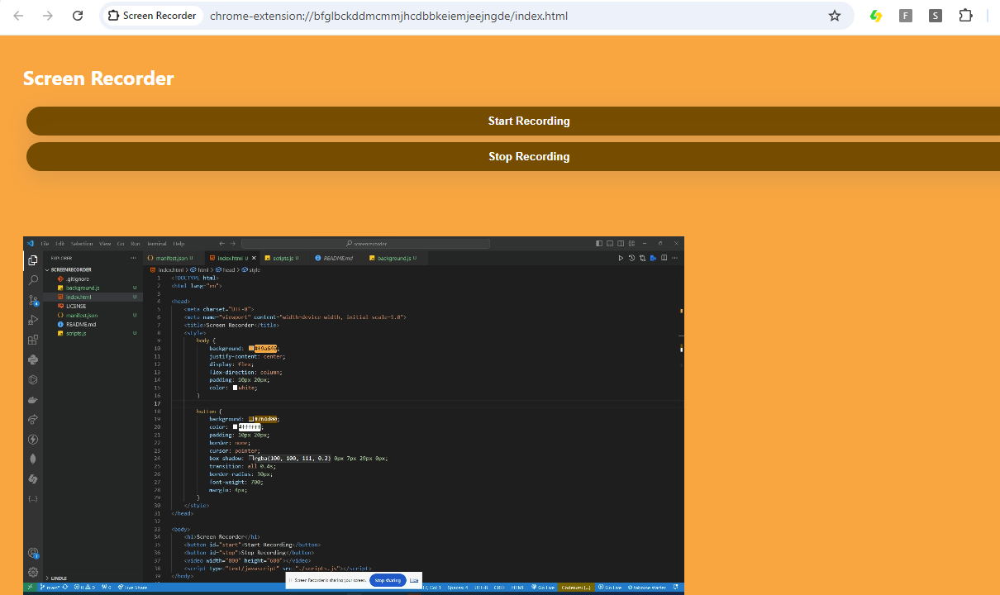

# Screen Recorder
A chrome extensions that uses the chrome.desktopCapture API to capture the screen, window or individual tabs.

## Prerequisites
You should look at <b>navigator.mediaDevices.getUserMedia</b> to get streams and how to set up constraints for this sample project to make sense.
